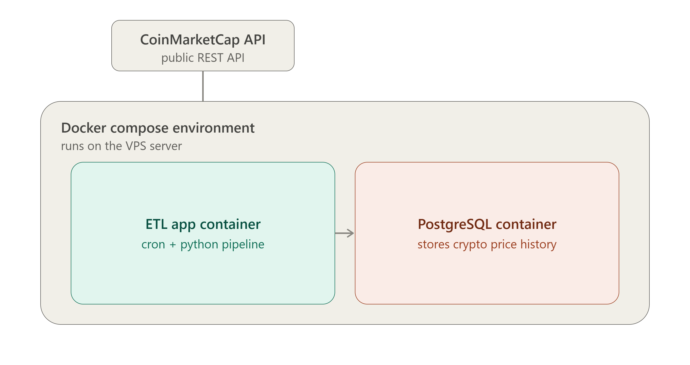

# Crypto ETL Pipeline

**Author:** Konstantinos Papadopoulos

An automated ETL (Extract, Transform, Load) pipeline that fetches cryptocurrency
market data from the CoinMarketCap API, cleans and transforms it, and loads it
into a PostgreSQL database. Fully containerized with Docker and scheduled via
Cron to run every 10 minutes, building a continuous historical dataset.

## Architecture

The pipeline runs inside a single Docker Compose environment with two services:

- **ETL app container** - a Python environment with a cron scheduler that
  triggers the pipeline every 10 minutes
- **PostgreSQL container** - stores every run's results in the
  `crypto_history` table, building a time-series dataset

## Data source

- **API:** [CoinMarketCap](https://coinmarketcap.com/api/) (free Basic plan)
- **Endpoint:** `/v1/cryptocurrency/listings/latest`
- **Data fetched per run:** top 50 cryptocurrencies by market cap

## Fields collected

| Field | Description |
|---|---|
| `name` | Cryptocurrency name |
| `symbol` | Ticker symbol |
| `price` | Current price in USD |
| `volume_24h` | Rolling 24h trading volume |
| `percent_change_24h` | 24h price change percentage (used as a volatility proxy) |
| `market_cap` | Market capitalization in USD |
| `fetched_at` | Timestamp of the data pull |

**Note:** the free CoinMarketCap tier does not provide 24h high/low (OHLCV)
data, which is only available on paid plans. `percent_change_24h` is used
instead as the volatility indicator for this project.

## Project structure
- `data/logs/` - execution logs from cron runs
- `src/extract.py` - fetches data from CoinMarketCap API
- `src/load.py` - inserts parsed records into PostgreSQL
- `src/etl_pipeline.py` - main entry point: extract -> transform -> load
- `docker/Dockerfile` - image definition for the Python app
- `docker/docker-compose.yml` - orchestration for app + PostgreSQL
- `docker/cron_job` - cron schedule definition
- `docker/entrypoint.sh` - passes environment variables to cron
- `sql_scripts/init.sql` - table schema, auto-run on first startup
- `sql_scripts/analysis.sql` - validation and analysis queries
- `documentation/architecture.png` - architecture diagram
- `.gitignore` - excludes secrets and local environment files
- `requirements.txt` - Python dependencies

## Validating the data

Connect to the database and run the queries in `sql_scripts/analysis.sql`,
for example:
docker exec -it crypto_postgres psql -U your_db_user -d your_db_name -c "SELECT COUNT(*) FROM crypto_history;"

## Project status

Fully functional — automated data collection running continuously